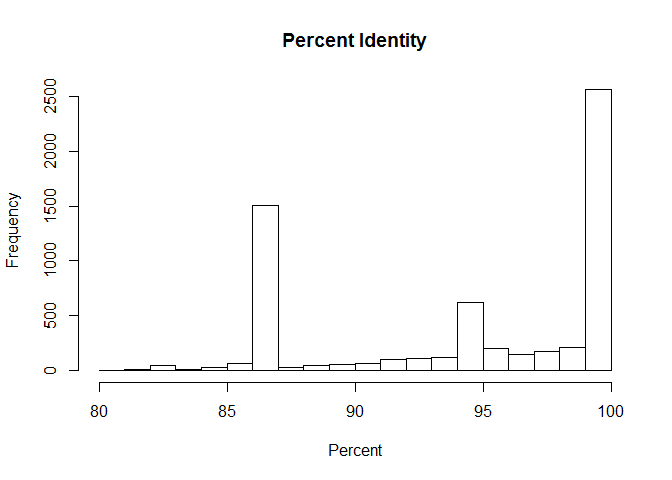

Analysis of BLAST Results
================
Emma Gibson
October 13, 2017

Introduction
============

As recent advancements in gene sequencing technology make studying microbiomes more and more accesible, studies of the human microbiomes have shown that they can vary widely from person to person. In this study, Fierer *et al.* focused on microbial communities living on peoples' skin. They were able to prove that miceobes from a person's skin can remain on an object they have touched for up to two weeks, and sequences from these microbes can be used to accurately match which person has touched a given object. Whereas the original authors focused on using skin microbes for forensic analysis, I focused on investigating what these unique communities could tell me about the individuals they came from.

Methods
=======

Sample origin and sequencing
----------------------------

The original samples were obtained from human volunteers and the keyboards/mice they touched, and collected with asterilized cotton-tipped swab that had been moistened by a sterile solution. The hands were swabbed at midday, and the mice and keyboards were swabbed within 12 hours of bein used by their respective owners. The sequences were obtained using high-throughput pyrosequencing of the 16S ribosomal gene.

Computational
-------------

The sequence data was analyzed using a combination of bash and R. First, the quality of each sequence was analyzed in bash using bioawk. After the sequenceswere revealed to be of good quality, a bash script was used to search the NCBI databank for the closest species matches, and document the results. After the bash analysis, several R analyses were used to determine the relatinoships of the various species. The relationship of subject's sex to their skin microbes was of particular interest.

Results
=======

The following libraries were used:

``` r
# Be sure to install these packages before running this script
# They can be installed either with the intall.packages() function
# or with the 'Packages' pane in RStudio

# load packages
library("dplyr")
```

    ## Warning: package 'dplyr' was built under R version 3.4.2

``` r
library("tidyr")
```

    ## Warning: package 'tidyr' was built under R version 3.4.2

``` r
library("knitr")
```

    ## Warning: package 'knitr' was built under R version 3.4.2

``` r
library("ggplot2")
```

    ## Warning: package 'ggplot2' was built under R version 3.4.2

Then, the data was read in using the following code:

``` r
# Output format from BLAST is as detailed on:
# https://www.ncbi.nlm.nih.gov/books/NBK279675/
# In this case, we used: '10 sscinames std'
# 10 means csv format
# sscinames means unique Subject Scientific Name(s), separated by a ';'
# std means the standard set of result columns, which are:
# 'qseqid sseqid pident length mismatch
# gapopen qstart qend sstart send evalue bitscore',


# this function takes as input a quoted path to a BLAST result file
# and produces as output a dataframe with proper column headers
# and the 'qseqid' column split into sample and seq number
read_blast_output <- function(filename) {
  data_in <- read.csv(filename,
                      header = FALSE, # files don't have column names in them
                      col.names = c("sscinames", # unique Subject Sci Name(s)
                                    "qseqid",    # Query Seq-id
                                    "sseqid",    # Subject Seq-id
                                    "pident",    # Percntge of identical matches
                                    "length",    # Alignment length
                                    "mismatch",  # Number of mismatches
                                    "gapopen",   # Number of gap openings
                                    "qstart",    # Start of alignment in query
                                    "qend",      # End of alignment in query
                                    "sstart",    # Start of alignment in subj
                                    "send",      # End of alignment in subject
                                    "evalue",    # Expect value
                                    "bitscore"))  # Bit score

  # Next we want to split the query sequence ID into
  # Sample and Number components so we can group by sample
  # They originally look like "ERR1942280.1"
  # and we want to split that into two columns: "ERR1942280" and "1"
  # we can use the separate() function from the tidyr library to do this
  # Note that we have to double escape the period for this to work
  # the syntax is
  # separate(column_to_separate,
  # c("New_column_name_1", "New_column_name_2"),
  # "seperator")
  data_in <- data_in %>%
    separate(qseqid, c("sample_name", "sample_number"), "\\.")
}
```

``` r
# this makes a vector of all the BLAST output file names, including
# the name(s) of the directories they are in
files_to_read_in <- list.files(path = "output/blast",
                               full.names = TRUE)

# We need to create an empty matrix with the right number of columns
# so that we can rbind() each dataset on to it
joined_blast_data <- matrix(nrow = 0,
                            ncol = 14)

# now we loop over each of the files in the list and append them
# to the bottom of the 'joined_blast_data' object
# we do this with the rbind() function and the function we
# made earlier to read in the files, read_blast_output()
for (filename in files_to_read_in) {
  joined_blast_data <- rbind(joined_blast_data,
                             read_blast_output(filename))
}
```

``` r
# Next we want to read in the metadata file so we can add that in too
# This is not a csv file, so we have to use a slightly different syntax
# here the `sep = "\t"` tells the function that the data are tab-delimited
# and the `stringsAsFactors = FALSE` tells it not to assume that things are
# categorical variables
metadata_in <- read.table(paste0("data/metadata/",
                                 "fierer_forensic_hand_mouse_SraRunTable.txt"),
                          sep = "\t",
                          header = TRUE,
                          stringsAsFactors = FALSE)

# Finally we use the left_join() function from dplyr to merge or 'join' the
# combined data and metadata into one big table, so it's easier to work with
# in R the `by = c("Run_s" = "sample_name")` syntax tells R which columns
# to match up when joining the datasets together
joined_blast_data_metadata <- metadata_in %>%
  left_join(joined_blast_data,
            by = c("Run_s" = "sample_name"))
```

#### Figure 1. Percent identity in human hand-associated bacteria

``` r
# Here we're using the dply piping syntax to select a subset of rows matching a
# criteria we specify (using the filter) function, and then pull out a column
# from the data to make a histogram. We don't need to tell the hist() function
# which data to use, because that's piped in, but we do have to give the
# hist() function the title and axis label we'd like to use for the figure
joined_blast_data_metadata %>%
  filter(env_material_s == "sebum") %>%
  pull(pident) %>%
  hist(main = "Percent Identity",
       xlab = "Percent")
```

    ## Warning: package 'bindrcpp' was built under R version 3.4.2

 Here, I analyzed what percent identity was most common for the BLAST results.

#### Figure 2. Most common species with ~86% identity match

``` r
# this code finds samples with a percent identity between 85 snd 87,
# then finds what species and how many of each have a percent
# identity within this range
joined_blast_data_metadata %>%
  filter(pident > 85 & pident < 87) %>%
  select(sscinames) %>%
  group_by(sscinames) %>%
  count() %>%
  arrange(desc(n)) %>%
  head(5) %>%
  ggplot(aes(x = sscinames, y = n)) +
  geom_bar(stat = "Identity") +
  theme(axis.text.x = element_text(angle = 10, hjust = 1)) +
  ggtitle("Most common species with 85-87% identity match") +
  xlab("Species name") +
  ylab("Number of sequences with 85-87% identity match")
```

 I found that there are a large number of sequences with around 86 percent identity. I decided to see if there was a certain species that was yielding many of these matches. After analyzing this, I found that over 2,000 of the 86% matches were *Solemya pervernicosa* gill symbiont.

#### Figure 3. Prominent species on female hands

``` r
# this code identifies the most common species in female hands
joined_blast_data_metadata %>%
  filter(env_material_s == "sebum" & sex_s == "female") %>%
  group_by(sscinames) %>%
  count() %>%
  arrange(desc(n)) %>%
  head(10) %>%
  ggplot(aes(x = sscinames, y = n)) +
  geom_bar(stat = "Identity", fill = "tomato1") +
  theme(axis.text.x = element_text(angle = 10, hjust = 1)) +
  ggtitle("Most common species in female hands") +
  xlab("Species name") +
  ylab("Number of Samples Found")
```

 After this, I decided to look at what the most common species was for female test subjects only.

#### Figure 4. Prominent species on male hands

``` r
# this code identifies the most common species in male hands
joined_blast_data_metadata %>%
  filter(env_material_s == "sebum" & sex_s == "male") %>%
  group_by(sscinames) %>%
  count() %>%
  arrange(desc(n)) %>%
  head(10) %>%
  ggplot(aes(x = sscinames,
             y = n)) +
  geom_bar(stat = "Identity", fill = "turquoise3") +
  theme(axis.text.x = element_text(angle = 10, hjust = 1)) +
  ggtitle("Most common species in male hands") +
  xlab("Species name") +
  ylab("Number of Sample Found")
```

 Next, I did the same for male hands, looking for the most prominent species.

#### Figure 5. Most prominent species in male and female hands

``` r
# this code ceates a graph to show the most common species among the sexes
joined_blast_data_metadata %>%
  filter(env_material_s == "sebum") %>%
  group_by(sscinames, sex_s) %>%
  count() %>%
  arrange(desc(n)) %>%
  head(15) %>%
  ggplot(aes(x = sscinames,
             y = n,
             fill = sex_s)) +
  geom_bar(stat = "Identity",
           position = "Dodge") +
  theme(axis.text.x = element_text(angle = -45, hjust = 0.05)) +
  ggtitle("Most common species in male and/or female hands") +
  xlab("Species name") +
  ylab("Number of Sample Found")
```

 Next, I looked at what species were most prominent among each sex, and found there was little overlap between what was common to one and what was common to another.

### Figure 6. Most prominent species with little differences between each sex

``` r
# this code makesa graph that shows the speceis whose presence is
# most similar between the sexes
# these first lines create a factor that has only male and female BLAST results
mf_in_common <- joined_blast_data_metadata %>%
  filter(env_material_s == "sebum") %>%
  group_by(sscinames, sex_s) %>%
  count() %>%
  spread(sex_s, n)

# these second lines find which species are the most
# similar among the sexes, and graphs the 10 most
# abundant species from the 30 most similar species
mf_in_common %>%
# first, we make 2 new columns with the percent of
# total matches in male/female hands each species
# makes up. Using the raw totals would throw off the
# analysis, because there was a different total of
# sequences in male vs female hands
  mutate(f_pcnt = female / sum(mf_in_common$female, na.rm = TRUE),
         m_pcnt = male / sum(mf_in_common$male, na.rm = TRUE)) %>%
# next, we change all of the blank slots where one
# of the sexes had no sequences from a blank to a 0
  mutate(f_pcnt = ifelse(is.na(f_pcnt), 0, f_pcnt),
         m_pcnt = ifelse(is.na(m_pcnt), 0, m_pcnt)) %>%
# then, we find the absolute value of the difference
# between the two percent values, so we can find which
# species have the smallest difference
  mutate(diff = abs(f_pcnt - m_pcnt)) %>%
  mutate(m_f = female + male, mf_pcnt = m_pcnt + f_pcnt) %>%
  arrange(desc(m_f)) %>%
  head(30) %>%
  arrange(diff) %>%
  head(10) %>%
  gather(key = "gender",
         value = "n",
         female, male) %>%
  ggplot(aes(x = sscinames,
             y = n,
             fill = gender)) +
  geom_bar(stat = "Identity",
           position = "dodge") +
  theme(axis.text.x = element_text(angle = -20, hjust = 0.05)) +
  ggtitle("Most common species (by total) among male and female hands") +
  xlab("Species name") +
  ylab("Number of species found")
```

 Given that there are prominent differences in the species prominent on male hands versus female hands, I next decided to take a look at what prominent species had the smallest difference between male and female hands. I found that of these species, none was found more than 25 times on any one gender's hands.

Discussion
==========

There appears to be a difference between the most prominent species in male and female hands. Strangely, the most prominent species on male hande was a gill symbiote of the clam species *Solemya permicosa*, whuch seems an odd thing to find on human hands. On female hands, the most common bacterium was *Bartonella washoensis*, a pathogen known to cause memingitis, which makes a little more sense. After seeing the great differences between male and female hands, I decided to look for what was the most similar between them. Most of these bacteria that were found in similar levels among the sexes were typical bacteria one might expect to see on a human hand, such as soil bacteria. However, what stands out about these bacteria is that there is significantly less of them than any of the major groups found in either sex. Even the most prominent of these has only around 15 individuals in female hands and 25 in male hands. This reinforces the idea that the microbial communities on a person'shands are highly individualized, because the none of the species that are common amongst both sexes are very prominent overall.

On a somewhat related note, when I looked at the initial percent identity chart, I noticed that there seemed to be a large number of species with around 86% match. When I looked into this, I noticed that there was one species that an overwhelming amount of these matches belonged to the *S. permicosa* gill symbiote, which also happened to be the most common match on male hands. While I thought that it was odd for a clam-associated bacterium to be on human hands, seeing that most of them had a relatively low match percentage compared to most of the other matches indictes that they could have been a mismatched species. It is quite possible that the actual bacterium on these subject's hands simply has not been sequenced yet.
